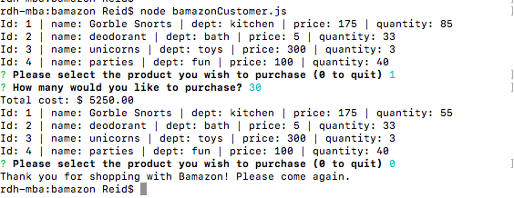
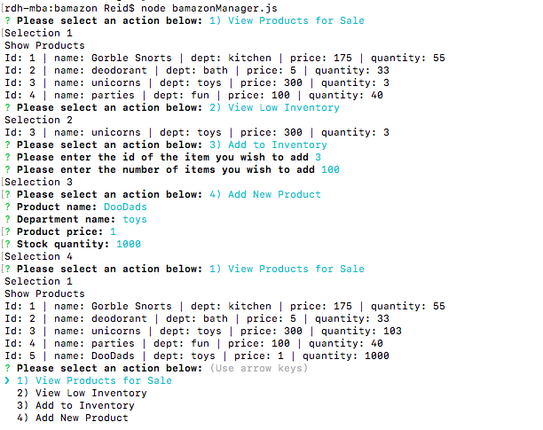

# bamazon

Bamazon is a mock online storefront with a customer and manager mode. This app uses a local mySQL database called "bamazon" - run bamazon.sql to intialize database.  

**Customer Portal**

Access the customer portal by typing `node bamazonCustomer.js` in the command line.  Then enter the item id you wish to purchase and the number of items you wish to buy.  If there is sufficient stock, the program will inform you of the total cost.

**Manager Portal**
Access the manager portal by typing `node bamazonManager.js` in the command line.  You will be prompted to select one of four actions:
* View Products - will display a cokmplete list of all products in stock.
* View Low Stock - will display a list of all products with 10 or fewer items in stock.
* Add Products - Select the product and number of items you wish to add.
* Add New Product - Enter the pertinent information at prompt to add additional products to your store front.  

Please contact reid.henderson@gmail.com with any questions or comments.
